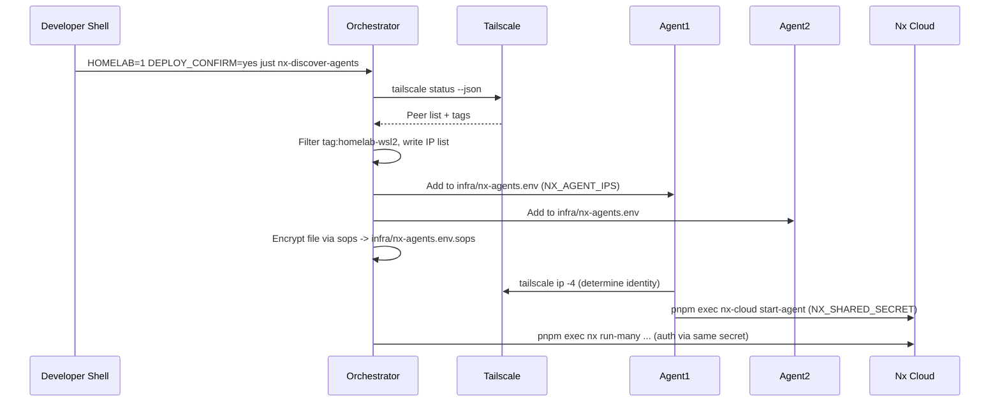

# Nx Distributed Architecture

Distributed execution relies on three moving parts: the orchestrator (where you run Nx commands), agents (workers connected via Tailscale), and an optional cache server served over the tailnet.

## Agent Discovery Sequence



## Cache Hierarchy Flow

```mermaid
graph TD
  A[Build Command] --> B{Cache Hit?}
  B -->|Yes| C[Tailnet HTTP Cache (Nx cache server)]
  C --> D[pnpm exec nx uses artifact]
  B -->|No| E[Local Execution]
  E --> F[Upload to Nx Cloud cache]
  F --> G[Optional: Sync to Tailnet cache]
  G --> H[Other agents fetch via http://$TAILSCALE_IP:3333]
```

## Key Concepts

- **Shared secret**: `NX_SHARED_SECRET` lives in `infra/nx-agents.env.sops` and is never committed in plaintext.
- **Transport**: Agents connect over Tailscale so the orchestrator can reach them even when behind NAT.
- **Guards**: Every Nx just recipe still enforces `HOMELAB=1`, `DEPLOY_CONFIRM`, and `DRY_RUN`.
- **Devbox access**: `.envrc` only sets `DEVBOX_AVAILABLE=1` and defines `devbox-shell`; run `devbox shell` manually before invoking Devbox-specific tooling (pytest, `uv` installs, etc.).
- **Telemetry**: Start the cache server with `just nx-cache-server-start` to expose build artifacts inside the tailnet; stop it with `just nx-cache-server-stop` when done.

Use this doc together with `docs/Howto/Run Nx Distributed Task Execution.md` and the advanced tutorial `Setup-Three-Node-Distributed-Build.md` when scaling beyond a single laptop.
