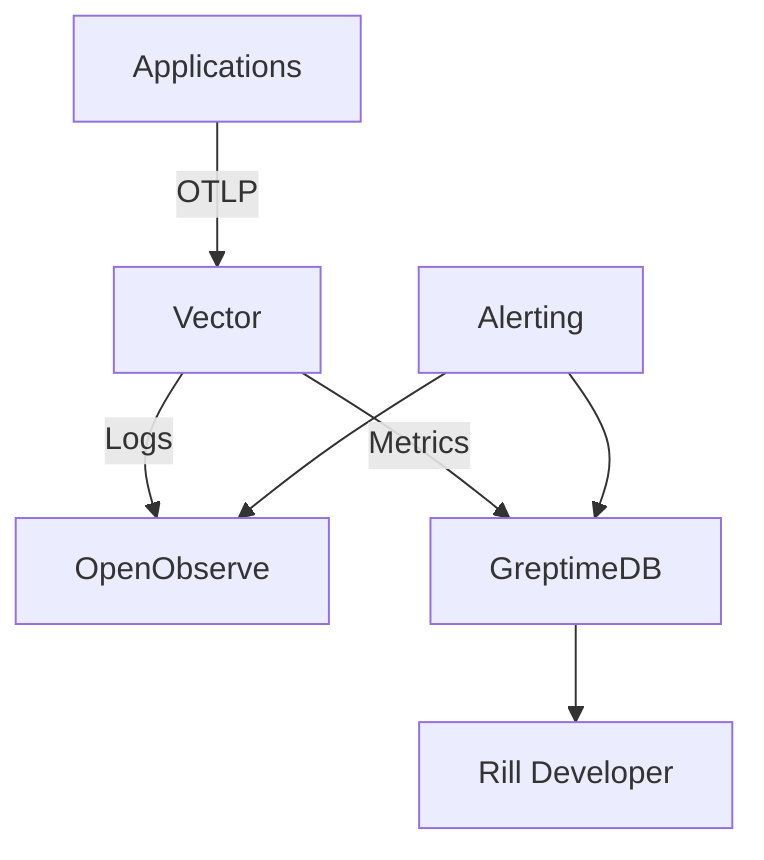

# Observability Operations Playbook

This guide covers the operational aspects of managing the homelab observability stack, including Vector upgrades, schema changes, GreptimeDB lifecycle management, and Rill dashboard governance.

## Table of Contents

1. [System Overview](#system-overview)
2. [Daily Operations](#daily-operations)
3. [Vector Management](#vector-management)
4. [Schema Management](#schema-management)
5. [GreptimeDB Operations](#greptimedb-operations)
6. [Rill Dashboard Governance](#rill-dashboard-governance)
7. [Troubleshooting](#troubleshooting)
8. [Disaster Recovery](#disaster-recovery)

## System Overview

The observability stack consists of four main components:



- **Vector**: Collects, transforms, and forwards logs and metrics
- **OpenObserve**: Log analytics and storage
- **GreptimeDB**: Metrics storage with Prometheus compatibility
- **Rill Developer**: Dashboard and visualization for metrics

## Daily Operations

### Health Checks

Run these commands daily to ensure system health:

```bash
# Check Vector status
devbox run vector --config ops/vector/vector.toml --validate

# Verify OpenObserve connectivity
curl -f http://localhost:5080/health || echo "OpenObserve unhealthy"

# Check GreptimeDB status
curl -f http://localhost:4000/health || echo "GreptimeDB unhealthy"

# Verify log ingestion
tail -f /tmp/vector-*.log | jq '.'
```

### Monitoring Retention

Monitor log retention to ensure compliance:

```bash
# Check OpenObserve stream retention
curl -s http://localhost:5080/api/streams | jq '.data[] | {name: .name, retention: .settings.retention_days}'

# Verify audit logs have 30-day retention
curl -s "http://localhost:5080/api/streams?q=category:audit" | jq '.data[] | {name: .name, retention: .settings.retention_days}'
```

## Vector Management

### Starting and Stopping Vector

```bash
# Start Vector with standard configuration
devbox run vector

# Start Vector with custom configuration file
vector --config /path/to/custom/vector.toml

# Stop Vector gracefully (precise targeting)
pkill -SIGTERM -f "/usr/local/bin/vector"

# Force stop (emergency only)
pkill -SIGKILL -f "/usr/local/bin/vector"
```

### Upgrading Vector

1. Check current version:
   ```bash
   vector --version
   ```

2. Update Vector in Devbox:
   ```bash
   # Update devbox.json with new Vector version
   # Then reinstall
   devbox install --tidy-lockfile
   ```

3. Validate configuration before restart:
   ```bash
   vector validate ops/vector/vector.toml
   ```

4. Restart with zero downtime:
   ```bash
   # Start new Vector instance on different ports
   vector --config ops/vector/vector.toml --config-dir /tmp/vector-new

   # Verify new instance is healthy
   curl -f http://localhost:14318/health

   # Stop old instance (precise targeting)
   pkill -SIGTERM -f "vector.*4317" || systemctl stop vector
   ```

### Configuration Changes

1. Always validate changes:
   ```bash
   vector validate ops/vector/vector.toml
   ```

2. Test transforms in isolation:
   ```bash
   # Create test input file
   echo '{"message": "test", "email": "user@example.com"}' > test.json

   # Test transform
   vector tap --config ops/vector/vector.toml --inputs-of otlp_logs --input test.json
   ```

3. Apply changes with rolling restart:
   ```bash
   # For production environments with multiple Vector instances
   # Restart one instance at a time
   systemctl restart vector@1
   # Verify health before proceeding to next instance
   ```

## Schema Management

### Schema Versioning

All schema changes must be documented in `docs/specs/log-schema.yaml`:

1. Add new revision entry:
   ```yaml
   revisions:
     - version: "1.1.0"
       date: "2025-XX-XX"
       author: "your-name"
       description: "Description of changes"
       changes:
         - "Added new_field for tracking X"
         - "Modified existing_field to include Y"
   ```

2. Update validation rules if needed.

3. Update redaction rules for new sensitive fields.

### Schema Migration Process

1. **Backward Compatible Changes** (adding optional fields):
   - Update schema documentation
   - Deploy updated logging helpers
   - Update Vector transforms to handle new fields
   - No downtime required

2. **Breaking Changes** (modifying required fields):
   - Schedule maintenance window
   - Deploy updated Vector transforms first (handle both old and new schemas)
   - Update all logging applications
   - Remove old schema handling after verification
   - Update schema documentation

### Testing Schema Changes

```bash
# Test schema compliance
npx nx run-many --target=logging --all

# Validate Vector transforms with new schema
vector validate ops/vector/vector.toml

# Test with sample data
echo '{"new_field": "value"}' | vector tap --config ops/vector/vector.toml
```

## GreptimeDB Operations

### Starting and Stopping GreptimeDB

```bash
# Start GreptimeDB
greptimedb serve --config ops/greptime/config.toml

# Stop GreptimeDB gracefully (precise targeting)
pkill -SIGTERM -f "/usr/local/bin/greptimedb" || systemctl stop greptimedb

# Check status
curl -f http://localhost:4000/health
```

### Configuration Management

GreptimeDB configuration is stored in `ops/greptime/config.toml`:

```toml
[storage]
data_dir = "/var/lib/greptimedb"

[http]
addr = "0.0.0.0:4000"

[prometheus]
addr = "0.0.0.0:4001"
```

### Data Retention

Configure retention policies in GreptimeDB:

```sql
-- Create table with retention
CREATE TABLE IF NOT EXISTS metrics (
  timestamp TIMESTAMP TIME INDEX,
  name STRING TAG,
  value DOUBLE,
  INSTANCE TAG
) ENGINE = metric
WITH (
  retention = '30d'
);

-- Alter existing table retention
ALTER TABLE metrics SET (retention = '60d');
```

### Backup and Restore

```bash
# Backup data
greptimedb export --data-dir /var/lib/greptimedb --output backup-$(date +%Y%m%d).tar.gz

# Restore data
greptimedb import --data-dir /var/lib/greptimedb --input backup-20251020.tar.gz
```

### Performance Tuning

Monitor GreptimeDB performance:

```bash
# Check metrics endpoint
curl http://localhost:4001/metrics | grep greptime

# Monitor query performance
curl -X POST http://localhost:4000/v1/sql \
  -H "Content-Type: application/json" \
  -d '{"sql": "SHOW TABLES"}'
```

## Rill Dashboard Governance

### Dashboard Management

1. **Creating Dashboards**:
   ```bash
   # Create new dashboard project
   rill init observability-dashboard
   cd observability-dashboard

   # Define metrics in metrics.yaml
   cat > metrics/response_time.yaml << EOF
   type: metrics_view
   table: metrics
   time_column: timestamp
   measures:
     - name: response_time
       expression: "value"
       aggregation: "avg"
   dimensions:
     - name: name
       expression: "name"
   filters:
     - name: response_time
   EOF

   # Start Rill Developer
   rill start
   ```

2. **Dashboard Version Control**:
   - Store dashboard definitions in version control
   - Use semantic versioning for dashboard releases
   - Document schema dependencies in dashboard metadata

3. **Access Control**:
   - Implement role-based access control
   - Restrict access to sensitive dashboards
   - Audit dashboard access regularly

### Data Source Configuration

Connect Rill to GreptimeDB:

```yaml
# rill.yaml
sources:
  greptimedb:
    type: greptimedb
    host: localhost
    port: 4000
    database: default
```

### Governance Policies

1. **Dashboard Naming Conventions**:
   - Use descriptive names: `service-metrics-overview`
   - Include service name and purpose
   - Avoid spaces and special characters

2. **Metric Definitions**:
   - Standardize metric names across dashboards
   - Document metric calculations
   - Include units and descriptions

3. **Change Management**:
   - Review dashboard changes before deployment
   - Test dashboards in staging environment
   - Monitor dashboard performance impact

## Troubleshooting

### Common Issues

**Vector fails to start**:
```bash
# Check configuration syntax
vector validate ops/vector/vector.toml

# Check port conflicts
netstat -tulpn | grep -E ":(4317|4318)"

# Check logs
journalctl -u vector -f
```

**Logs not appearing in OpenObserve**:
```bash
# Check Vector health
curl http://localhost:9000/health

# Check OpenObserve connectivity
curl -f http://localhost:5080/health

# Check Vector transform pipeline
vector tap --config ops/vector/vector.toml
```

**Metrics not appearing in GreptimeDB**:
```bash
# Check GreptimeDB status
curl http://localhost:4000/health

# Check Prometheus endpoint
curl http://localhost:4001/metrics

# Verify Vector metrics sink
curl http://localhost:9000/metrics | grep vector
```

### Debug Mode

Enable debug logging:

```bash
# Vector debug mode
RUST_LOG=debug vector --config ops/vector/vector.toml --verbose

# Check transform pipeline
vector top --config ops/vector/vector.toml
```

### Log Analysis

Search logs for issues:

```bash
# Vector errors
grep "ERROR" /tmp/vector-*.log | tail -20

# Connection issues
grep "connection" /tmp/vector-*.log | tail -20

# Transform failures
grep "transform" /tmp/vector-*.log | tail -20
```

## Disaster Recovery

### Backup Strategy

1. **Configuration Backups**:
   ```bash
   # Backup all observability configurations
   tar -czf observability-config-$(date +%Y%m%d).tar.gz ops/ docs/

   # Store backup in secure location
   # scp to backup server or cloud storage
   ```

2. **Data Backups**:
   ```bash
   # OpenObserve backup
   curl -X POST http://localhost:5080/api/backup \
     -H "Content-Type: application/json" \
     -d '{"destination": "backup-20251020"}'

   # GreptimeDB backup
   greptimedb export --output greptime-backup-$(date +%Y%m%d).tar.gz
   ```

### Recovery Procedures

1. **Partial Recovery** (single component):
   - Restore configuration for affected component
   - Restart component
   - Verify connectivity with other components

2. **Full Recovery** (entire stack):
   - Restore all configurations from backup
   - Start components in order: GreptimeDB, OpenObserve, Vector, Rill
   - Verify end-to-end functionality
   - Check data integrity

### Incident Response

1. **Detection**:
   - Monitor system health alerts
   - Check dashboard metrics
   - Review error logs

2. **Assessment**:
   - Identify affected components
   - Determine impact scope
   - Estimate recovery time

3. **Resolution**:
   - Apply fixes or restore from backup
   - Verify system recovery
   - Document incident and improvements

## Maintenance Windows

Schedule regular maintenance for:

- **Weekly**: Health checks, log rotation, performance monitoring
- **Monthly**: Security updates, configuration reviews, backup verification
- **Quarterly**: Schema reviews, capacity planning, documentation updates

Always notify users of scheduled maintenance and provide rollback procedures.
