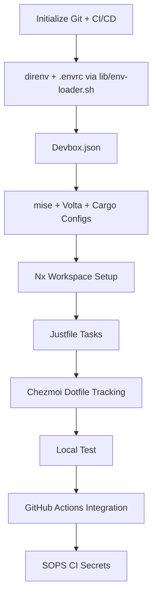

Here is the correct **implementation sequence**, de-duplicated, dependency-ordered, and optimized to avoid technical debt.

---

## 🧱 Implementation Sequence (Best-Practice Order)

|    #   | Step                                           | Purpose                                                                                        | Depends On                   |
| :----: | :--------------------------------------------- | :--------------------------------------------------------------------------------------------- | :--------------------------- |
|  **1** | **Initialize Git repository and branch rules** | Establish version control, branch protection, and CI/CD triggers foundation.                   | —                            |
|  **2** | **Install direnv and template `.envrc`**       | Gate environment loading, delegate to `lib/env-loader.sh`, and record `direnv allow` workflow. | Git init                     |
|  **3** | **Create base `devbox.json`**                  | Define OS-level dependencies (pnpm, uv, mise, just, sops, volta, cargo).                       | direnv `.envrc` in place     |
|  **4** | **Configure `.mise.toml`**                     | Pin global runtime versions (Node, Python, Rust).                                              | Devbox                       |
|  **5** | **Integrate Volta**                            | Manage Node/TypeScript toolchain binaries (npm, pnpm, yarn).                                   | mise                         |
|  **6** | **Integrate Cargo**                            | Manage Rust dependencies and crate builds.                                                     | mise                         |
|  **7** | **Create `nx.json` and `workspace.json`**      | Define monorepo structure, default targets, caching, and plugin setup.                         | Volta + Cargo                |
|  **8** | **Update Nx plugin configuration**             | Add executors for Cargo, Python, and Volta-managed Node projects.                              | nx.json                      |
|  **9** | **Write `Justfile` recipes**                   | Define workflow commands (`setup`, `build`, `test`, `lint`, `deploy`).                         | Nx config                    |
| **10** | **Add all config files to Chezmoi**            | Track dotfiles (`.envrc`, `.mise.toml`, `.volta`, `.justfile`, `devbox.json`, etc.) for reproducibility. | All local configs exist |
| **11** | **Test local reproducibility**                 | Run direnv `allow` → Devbox shell → mise → Volta → Nx → Just to confirm deterministic setup.   | Chezmoi                      |
| **12** | **Wire into GitHub Actions CI/CD**             | Automate `just build`, `nx test`, and deploy pipelines.                                        | Verified local setup         |
| **13** | **Add optional SOPS integration to CI**        | Secure secrets for builds and deployments.                                                     | CI/CD active                 |

---

## 🔁 Simplified Workflow

---

## ⚙️ Resulting System Integrity

* **Single source of truth:** Chezmoi deploys `.envrc`, tool configs, and secrets scaffolding.
* **Zero-drift environments:** direnv + Devbox + mise ensure parity across hosts.
* **Polyglot builds:** Nx handles Node, Python, and Rust seamlessly.
* **Idempotent automation:** Just and CI use identical recipes.
* **Secure reproducibility:** SOPS manages all secrets, no plaintext leakage.

---

### ✓ Completed → Next:

Set up:

1. `.envrc` template that shells out to `lib/env-loader.sh` and document `direnv allow`.
2. `devbox.json` (with all required binaries).
3. `.mise.toml` (Node, Python, Rust versions).
4. `.volta` and Cargo project scaffolds.

→ Say **“devbox and mise baseline”** to generate those configuration files next.
