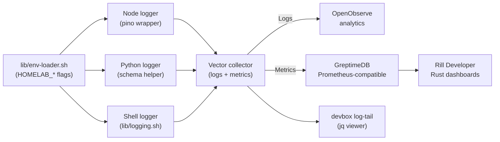

HOMELAB-ADR-002 — Structured Logging & Telemetry Backbone
Status: Active (feature-flagged)



Summary
- unify JSON logging across Node Nx utilities, Python helpers, and shell automation
- integrate with environment bootstrap (`devbox`, `lib/env-loader.sh`) and GitHub Actions pipeline
- stream events to OpenObserve via a Vector collector while keeping stdout-based local developer experience
- extend instrumentation for tracing and metrics so logs, spans, and Prometheus-style data share identifiers

Context
Homelab currently relies on emoji-forward console output inside `apps/env-check/src/index.js`, `scripts/env-check.sh`, and `main.py`. Formats differ per language, omit correlation metadata, and become hard to analyse once copied out of CI logs.
Nx targets (`lint`, `test`, `build`, `deploy`) run the same executables locally, inside Devbox shells, and in `.github/workflows/main-ci.yml`, so we need deterministic output that cooperates with `npx nx run-many` and GitHub log grouping.
`lib/env-loader.sh` already centralises environment bootstrapping across Devbox, Just, and CI. Extending it with logging switches keeps behaviour consistent without per-script environment hacks.

Decision
- Introduce a structured logging subsystem that exports to OpenObserve by default, gated by `HOMELAB_OBSERVE` only for exceptional local overrides.
- Publish shared logging helpers in `tools/logging/node/`, `tools/logging/python/`, and `lib/logging.sh` so every entry point shares schema and configuration.
- Emit newline-delimited JSON to stdout/stderr in all environments and forward the same events to a local Vector agent that relays to OpenObserve through OTLP.
- Maintain distinct categories (`app`, `audit`, `security`) with 14-day retention for application logs and 30-day retention for audit/security streams.

Rationale
- Structured JSON removes parsing guesswork and remains GitHub-friendly while staying machine readable for post-processing.
- A single feature flag keeps local experiments lightweight and allows gradual rollout through Nx target dependencies and CI environments.
- Vector plus OpenObserve matches our self-hosted posture, avoids sidecar agents, and works across runtimes without per-language collectors.
- Shared helpers minimise duplication and keep developer-friendly formatting available (pretty printing, emoji) when the observe flag is disabled.

Architecture Overview
1. In-process instrumentation (Node, Python, Bash) enriches each event with timestamp, level, service, environment, version, category, and optional trace/span identifiers.
2. `lib/env-loader.sh` reads `.env` files, sets `HOMELAB_OBSERVE`, and exports `HOMELAB_LOG_TARGET` (`stdout` or `vector`) so Devbox, Just, and CI processes share defaults.
3. With vector mode active by default, a lightweight Vector binary (installed via Devbox) listens on localhost, applies redaction transforms, and forwards events to OpenObserve.
4. Dashboards and ad-hoc analysis run on OpenObserve; local developers can tail JSON logs directly from stdout using `jq` or `bunyan`.
5. Vector also emits Prometheus-compatible metrics into GreptimeDB, where Rill Developer provides Grafana-like dashboards without containers.

## Tooling Overview

| Component | Role | Notes |
|-----------|------|-------|
| `lib/env-loader.sh` | Bootstrap `HOMELAB_OBSERVE=1`, `HOMELAB_LOG_TARGET`, environment/service metadata | Invoked by Devbox init hooks, Just recipes, CI bootstrap |
| `tools/logging/node/logger.js` | Pino-based logger with schema enforcement, OpenTelemetry span binding | Consumed by `apps/env-check/src/index.js` and future Node utilities |
| `tools/logging/python/logger.py` | Structlog configuration with JSON renderer and OTEL context | Used by `main.py` and upcoming Python scripts |
| `lib/logging.sh` | Shell logging API emitting JSON or pretty text, plus metric helpers | Adopt in `scripts/env-check.sh`, `scripts/doctor.sh`, new automation |
| Vector (`ops/vector/vector.toml`) | Rust collector handling log/metric ingestion, redaction, fan-out | Runs via Devbox/systemd; validated by CI scripts |
| OpenObserve | Log analytics, retention, and alerting surface | Receives OTLP logs from Vector |
| GreptimeDB | Rust-native Prometheus-compatible metrics store | Receives metrics from Vector without container runtime |
| Rill Developer | Rust dashboard UI for metrics | Connects to GreptimeDB to deliver Grafana-like views |
| `devbox run log-tail` | Developer command piping JSON through `jq` | Enables quick local inspection when OpenObserve is offline |
| `tests/ops/test_vector_config.sh`, `tests/ops/test_metrics_pipeline.sh` | CI automation for schema/redaction/metrics checks | Backed by Nx targets `logging` and `metrics` |

## Implementation Details

### Feature Flag & Environment Bootstrap
- Extend `lib/env-loader.sh` to default `HOMELAB_OBSERVE=1` and derive `HOMELAB_LOG_TARGET=${HOMELAB_OBSERVE:+vector}` (fallback to `stdout` only when the flag is explicitly disabled).
- Export `HOMELAB_SERVICE` and `HOMELAB_ENVIRONMENT` defaults based on `HOMELAB_ENV_MODE` (`developer-shell`, `devbox-shell`, `ci-pipeline`) and make them overrideable per process.
- Ensure Devbox init hooks, `scripts/env-check.sh`, and `.github/workflows/main-ci.yml` call `lib/env-loader.sh` so the same values reach Node, Python, and shell entry points.
- Document override patterns (`HOMELAB_OBSERVE=0 npx nx run env-check:test` for offline debugging) in `docs/README-env.md`.

### Common Schema & Metadata
- Required keys: `timestamp`, `level`, `message`, `service`, `environment`, `version`, `category`, `event_id`, `trace_id`, `span_id`, `context`.
- Optional keys: `request_id`, `user_hash`, `source`, `duration_ms`, `status_code`, `tags` (array).
- ISO-8601 UTC timestamps; levels restricted to `error`, `warn`, `info`, `debug`.
- Ensure `event_id` is monotonic per process to simplify tailing and correlation when trace data is absent.
- Reserve metric-compatible fields (`metric_name`, `metric_value`, `metric_unit`) and OpenTelemetry resource attributes (`otel_resource`) so logs and metrics can be joined downstream.

### Node Instrumentation (`apps/env-check`)
- Create `tools/logging/node/logger.js` exporting a configured `pino` instance with serializers for errors and metadata injection.
- Wrap existing `console.log` usage in `apps/env-check/src/index.js` with the shared logger (e.g., `const log = require('../../tools/logging/node/logger'); log.info({ mode }, 'env-check start');`).
- Provide helper utilities to bind `service`, `version` (from `package.json`), and `environment` automatically; expose `withSpan(spanContext, fn)` to attach trace data when available.
- Add an Nx target (`log-smoke`) under `apps/env-check/project.json` that runs a lightweight logger health check using the shared helper, and wire it into the `deploy` target `dependsOn`.
- Initialise OpenTelemetry (`@opentelemetry/api`, `@opentelemetry/sdk-node`) during CLI bootstrap so the logger can populate `trace_id`/`span_id` and emit metrics counters when needed.

### Python Instrumentation (`main.py` and future scripts)
- Add `tools/logging/python/logger.py` that provides a dependency-free schema helper, merges in environment metadata, and honours `HOMELAB_LOG_TARGET`.
- Update `main.py` to call the shared logger instead of raw `print`, preserving CLI output when observation is disabled by using a colorised console renderer.
- Provide a helper `bind_trace(trace_id, span_id)` for optional tracing support and ensure the module discovers the project version from `pyproject.toml`.
- Integrate `opentelemetry-sdk` and `opentelemetry-instrumentation` packages so span context is bound automatically and metrics counters can be emitted alongside logs.

### Shell Instrumentation
- Introduce `lib/logging.sh` with functions `log_info`, `log_warn`, `log_error`, and `log_debug` that emit JSON (with fallbacks to formatted text when `HOMELAB_LOG_TARGET=stdout` and TTY is present).
- Refactor `scripts/env-check.sh` and `scripts/doctor.sh` to use the shared shell logger, keeping emoji output behind the pretty formatter.
- Make the shell helper responsible for routing to Vector whenever `HOMELAB_LOG_TARGET=vector` (default), while falling back gracefully when explicitly overridden.
- Add `log_metric` and `log_span breadcrumb` helpers that mirror the Node/Python APIs, ensuring bash scripts can emit consistent telemetry.

### Nx & CI Integration
- Register a workspace-level target (e.g., `logging:check`) in `workspace.json` via a custom executor under `tools/tasks/logging-check.js` that verifies helper modules and schema.
- Update `.github/workflows/main-ci.yml` to run `npx nx run-many --target=logging --all` after `test`, ensuring schema drift is caught in CI.
- Add a Just recipe `just logging` that runs the same target for local smoke tests.

### Vector & OpenObserve
- Store Vector configuration in `ops/vector/vector.toml`, defining OTLP sources for logs, JSON parsing, and VRL transforms for redaction.
- Include installation instructions in `devbox.json` (package `vector`) and expose `devbox run vector` commands for local testing.
- In production or staging environments, deploy Vector as a standalone service managed by systemd or container orchestrator; document port bindings and credentials in `docs/reference/logging.md`.
- Configure additional Vector sinks to GreptimeDB (metrics) and local stdout tailing, and provide VRL transforms for metric tagging and sampling.

### PII Governance & Security
- Redact patterns: email addresses, access tokens (`Authorization`, `authorization`, `api_key`, `password`, `token`), and session identifiers before logs leave the host.
- Keep audit/security categories immutable; only allow escalation of level to `warn`/`error` automatically if the category is `security`.
- Track schema revisions in `docs/specs/log-schema.yaml` (to be created) for auditing and change control.

## Log Event Example

```json
{
  "timestamp": "2025-02-15T12:34:56.789Z",
  "level": "info",
  "message": "env-check completed",
  "service": "env-check",
  "environment": "ci-pipeline",
  "version": "0.0.0",
  "category": "app",
  "event_id": "evt_1697795116818_1",
  "trace_id": "4f3a8f9d2f8d4f1c",
  "span_id": "7a1d3c92f6ab2e11",
  "context": {
    "mode": "deploy",
    "duration_ms": 322,
    "missing_env": []
  }
}
```

## Levels & Categories

- Levels: `error`, `warn`, `info`, `debug` (no `trace`; defer to tracing spans).
- Categories: `app` (default business flow), `audit` (compliance-sensitive events), `security` (alerts, auth failures).
- Enforce categories via helper defaults; require explicit opt-in for `audit`/`security`.

## Operations & Governance

- Retention: `app` logs 14 days, `audit` and `security` logs 30 days minimum.
- Access: restrict OpenObserve datasets by category using role-based access control.
- Cost controls: enable sampling in Vector for noisy `debug` logs and provide per-category toggles via environment variables (`HOMELAB_LOG_SAMPLE_DEBUG=0.25`).
- Document operational playbooks in `docs/how-to/observability.md`, covering Vector upgrades, schema changes, GreptimeDB lifecycle, and Rill dashboard governance.
- Capture GreptimeDB retention settings and Rill export/import workflows so operators understand the metrics path end-to-end.

## Rollout Plan

- Phase 0 (Bootstrap): Land shared helpers, update `env-check` and `main.py`, add Vector config with the export enabled by default, ship documentation.
- Phase 1 (Adoption): Run `HOMELAB_OBSERVE=1` in staging CI runs to validate Vector redaction and ensure log schema compliance via automated tests.
- Phase 2 (GA): Keep the flag on by default for CI and long-lived environments; require new scripts and services to use the shared helpers before merging.
- Phase 3 (Continuous Improvement): Add tracing correlation, per-category alerting, and dashboards in OpenObserve; measure query SLAs.
- Phase 4 (Metrics & Dashboards): Stand up GreptimeDB + Rill Developer, connect Vector metrics sinks, and add pipeline smoke tests.

## Testing & Validation

- `tools/logging/test_node_logger.js`: verifies schema, pretty printing, and error serialization.
- `tools/logging/test_structlog.py`: ensures Python renderer matches Node output byte-for-byte for the same payload.
- `tools/logging/test_shell_logger.sh`: asserts JSON output even when stdout is redirected.
- `tests/ops/test_vector_config.sh`: lint Vector config (VRL parsing, redaction transforms, sink wiring).
- `tests/ops/test_metrics_pipeline.sh`: validate Vector → GreptimeDB ingestion, sampling rules, and retention.
- CI assertions: `npx nx run-many --target=logging --all` must pass before deploy, enforced in `.github/workflows/main-ci.yml`.
- Add `npx nx run-many --target=metrics --all` once the metrics checks land; block deploys until both succeed.

## Follow-up Work

- Instrument future services added to `apps/` or `tools/` with the shared helpers on creation.
- Define a lightweight tracing story (OpenTelemetry SDK) to populate `trace_id`/`span_id` once workflows warrant it.
- Automate version injection (`git describe --tags`) inside the logger helpers.
- Add Devbox shortcuts (`devbox run log-tail`, `devbox run metrics-dash`) and document usage in `README-env.md`.
- Publish starter dashboards and alert rules for OpenObserve, GreptimeDB, and Rill to accelerate team adoption.

## Related Artifacts

- `lib/env-loader.sh` — loads feature flags and logging targets.
- `apps/env-check/project.json` — Nx targets that will depend on the logging checks.
- `apps/env-check/src/index.js` — first consumer of the Node logger.
- `main.py` — Python entry point to adopt structured logging.
- `.github/workflows/main-ci.yml` — CI pipeline to run logging checks and bootstrap Vector when required.
- `devbox.json` — development environment where Vector and supporting tooling are installed.
- `ops/vector/vector.toml` — Vector pipeline definition (new file).
- `ops/greptime/config.toml` — GreptimeDB single-binary configuration (new file).
- `ops/rill/config.yaml` — Rill Developer project definition (new file).
- `docs/how-to/observability.md` — operational playbook to maintain.
- `tests/ops/test_metrics_pipeline.sh` — metrics validation automation (new file).

## Technical Debt & Mitigation

- Update `lib/env-loader.sh` to export `HOMELAB_OBSERVE=1`, `HOMELAB_LOG_TARGET`, and service metadata; without this every consumer must configure flags manually.
- Create the shared logging helpers (`tools/logging/node/logger.js`, `tools/logging/python/logger.py`, `lib/logging.sh`) plus their automated tests before migrating existing scripts.
- Commit Vector, GreptimeDB, and Rill configuration under `ops/` with CI linting (`tests/ops/test_vector_config.sh`, `tests/ops/test_metrics_pipeline.sh`) to stop drift.
- Replace emoji-style logging in `scripts/env-check.sh` and `scripts/doctor.sh` with the new helpers so output stays schema-compliant.
- Wire OpenTelemetry dependencies into `package.json` and `pyproject.toml`, ensuring Nx targets bootstrap tracing so `trace_id`/`span_id` are never empty.
- Author an incident handbook for restarting Vector, GreptimeDB, and Rill binaries in environments without containers, covering log locations and health checks.
