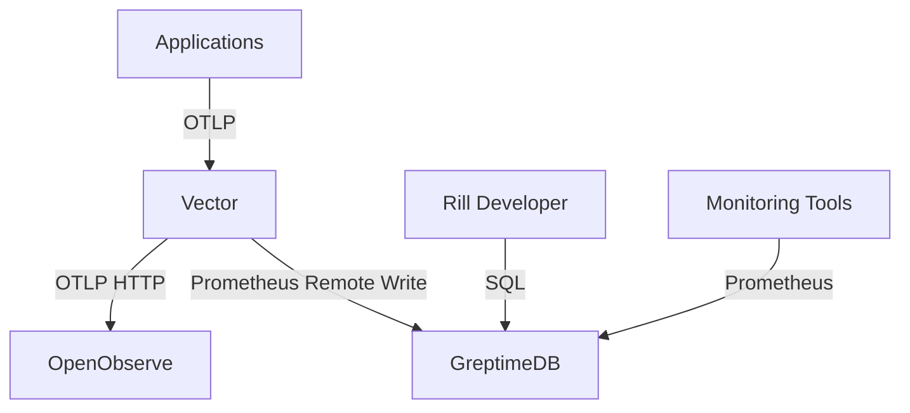

# Logging System Reference

This reference guide provides detailed information about the logging system configuration, including port bindings, credentials, and environment-specific settings for Vector in development, staging, and production environments.

## Table of Contents

1. [System Architecture](#system-architecture)
2. [Port Bindings](#port-bindings)
3. [Authentication and Credentials](#authentication-and-credentials)
4. [Environment Configurations](#environment-configurations)
5. [Client Configuration](#client-configuration)
6. [API Endpoints](#api-endpoints)
7. [Security Considerations](#security-considerations)

## System Architecture

The logging system consists of several components that work together to collect, process, and store log data:



## Port Bindings

### Vector

| Port | Protocol | Purpose | Environment |
|------|----------|---------|-------------|
| 4317 | gRPC | OTLP logs ingestion (gRPC) | All |
| 4318 | HTTP | OTLP logs ingestion (HTTP) | All |
| 9000 | HTTP | Vector API and metrics | All |
| 9001 | HTTP | Vector internal metrics | All |

### OpenObserve

| Port | Protocol | Purpose | Environment |
|------|----------|---------|-------------|
| 5080 | HTTP | Web UI and API | All |
| 5081 | HTTP | Internal API | All |

### GreptimeDB

| Port | Protocol | Purpose | Environment |
|------|----------|---------|-------------|
| 4000 | HTTP | SQL API | All |
| 4001 | HTTP | Prometheus remote write | All |
| 4002 | TCP | MySQL protocol (optional) | All |

### Rill Developer

| Port | Protocol | Purpose | Environment |
|------|----------|---------|-------------|
| 8080 | HTTP | Web UI | All |
| 8081 | HTTP | API | All |

## Authentication and Credentials

### Vector Authentication

Vector supports various authentication methods for different sinks:

#### OpenObserve Authentication

```toml
# In ops/vector/vector.toml
[sinks.openobserve]
type = "otel_logs"
endpoint = "http://localhost:5080/otlp/v1/logs"
# Basic authentication (optional)
# auth.strategy = "basic"
# auth.user = "${OPENOBSERVE_USER}"
# auth.password = "${OPENOBSERVE_PASSWORD}"
```

> ⚠️ **SECURITY WARNING**: Credentials must never be hardcoded or committed to version control. Always source credentials from a secure secret store (e.g., HashiCorp Vault, AWS Secrets Manager, Kubernetes secrets).

Environment variables:
- `OPENOBSERVE_USER`: Username for OpenObserve (if required)
- `OPENOBSERVE_PASSWORD`: Password for OpenObserve (if required)

#### GreptimeDB Authentication

```toml
# In ops/vector/vector.toml
[sinks.greptimedb]
type = "prometheus_remote_write"
endpoint = "http://localhost:4000/v1/prometheus/write"
# Basic authentication (optional)
# auth.strategy = "basic"
# auth.user = "${GREPTIMEDB_USER}"
# auth.password = "${GREPTIMEDB_PASSWORD}"
```

> ⚠️ **SECURITY WARNING**: Credentials must never be hardcoded or committed to version control. Always source credentials from a secure secret store (e.g., HashiCorp Vault, AWS Secrets Manager, Kubernetes secrets).

Environment variables:
- `GREPTIMEDB_USER`: Username for GreptimeDB (if required)
- `GREPTIMEDB_PASSWORD`: Password for GreptimeDB (if required)

### OpenObserve Credentials

OpenObserve can be configured with different authentication methods:

```yaml
# OpenObserve configuration (data/zo.cfg)
auth: {
  # Enable authentication
  enabled: true,

  # Authentication method
  mode: "basic",  # Options: "basic", "jwt", "oauth2"

  # Default admin user (created on first start)
  root_user: "admin",
  root_password: "CHANGE_THIS_STRONG_PASSWORD",  # Use a strong, unique password

  # JWT settings (if using JWT)
  jwt_secret: "${JWT_SECRET}",
  token_expire: 3600  # seconds
}
```

### GreptimeDB Credentials

GreptimeDB authentication configuration:

```toml
# In ops/greptime/config.toml
[http]
addr = "0.0.0.0:4000"
# Enable authentication
auth_enabled = true
auth_public_key = "/path/to/public_key.pem"

[prometheus]
addr = "0.0.0.0:4001"
# Enable authentication
auth_enabled = true
auth_public_key = "/path/to/public_key.pem"

# User configuration
[[users]]
name = "admin"
password_hash = "hashed_password"
roles = ["admin"]

[[users]]
name = "vector"
password_hash = "hashed_password"
roles = ["write"]
```

> ⚠️ **SECURITY WARNING**: Credentials must never be hardcoded or committed to version control. Always source credentials from a secure secret store (e.g., HashiCorp Vault, AWS Secrets Manager, Kubernetes secrets).

## Environment Configurations

### Development Environment

```bash
# Environment variables for development
export HOMELAB_OBSERVE=1
export HOMELAB_LOG_TARGET=vector
export HOMELAB_ENVIRONMENT=developer-shell
export ENVIRONMENT=development
export VECTOR_ENDPOINT="http://localhost:4317"

# Vector configuration uses default ports
# OpenObserve: http://localhost:5080
# GreptimeDB: http://localhost:4000
```

### Staging Environment

```bash
# Environment variables for staging
export HOMELAB_OBSERVE=1
export HOMELAB_LOG_TARGET=vector
export HOMELAB_ENVIRONMENT=staging
export ENVIRONMENT=staging

# Staging-specific endpoints
export OPENOBSERVE_ENDPOINT="https://logs-staging.example.com"
export GREPTIMEDB_ENDPOINT="https://metrics-staging.example.com"
export VECTOR_ENDPOINT="https://vector-staging.example.com:4317"
export OPENOBSERVE_USER="${OBSERVE_STAGING_USER}"
export OPENOBSERVE_PASSWORD="${OBSERVE_STAGING_PASSWORD}"
export GREPTIMEDB_USER="${GREPTIME_STAGING_USER}"
export GREPTIMEDB_PASSWORD="${GREPTIME_STAGING_PASSWORD}"
```

Staging Vector configuration (`ops/vector/vector-staging.toml`):

```toml
# Sources (same as production)
[sources.otlp_logs]
type = "otlp"
address = "0.0.0.0:4317"
healthcheck = true

[sources.otlp_http_logs]
type = "otlp"
address = "0.0.0.0:4318"
protocol = "http"
healthcheck = true

# Transforms (same as production)
[transforms.parse_json]
type = "remap"
inputs = ["otlp_logs", "otlp_http_logs"]
source = """
. = parse_json!(.message)
"""

# Sinks with staging endpoints
[sinks.openobserve]
type = "otel_logs"
inputs = ["add_metadata"]
endpoint = "${OPENOBSERVE_ENDPOINT}/otlp/v1/logs"
auth.strategy = "basic"
auth.user = "${OPENOBSERVE_USER}"
auth.password = "${OPENOBSERVE_PASSWORD}"
healthcheck = true

[sinks.greptimedb]
type = "prometheus_remote_write"
inputs = ["extract_metrics"]
endpoint = "${GREPTIMEDB_ENDPOINT}/v1/prometheus/write"
auth.strategy = "basic"
auth.user = "${GREPTIMEDB_USER}"
auth.password = "${GREPTIMEDB_PASSWORD}"
healthcheck = true
```

### Production Environment

```bash
# Environment variables for production
export HOMELAB_OBSERVE=1
export HOMELAB_LOG_TARGET=vector
export HOMELAB_ENVIRONMENT=production
export ENVIRONMENT=production

# Production-specific endpoints
export OPENOBSERVE_ENDPOINT="https://logs.example.com"
export GREPTIMEDB_ENDPOINT="https://metrics.example.com"
export VECTOR_ENDPOINT="https://vector.example.com:4317"
export OPENOBSERVE_USER="${OBSERVE_PROD_USER}"
export OPENOBSERVE_PASSWORD="${OBSERVE_PROD_PASSWORD}"
export GREPTIMEDB_USER="${GREPTIME_PROD_USER}"
export GREPTIMEDB_PASSWORD="${GREPTIME_PROD_PASSWORD}"

# Production-specific settings
export HOMELAB_LOG_SAMPLE_DEBUG=0.1  # Sample 10% of debug logs
export HOMELAB_LOG_SAMPLE_INFO=0.5  # Sample 50% of info logs
```

Production Vector configuration (`ops/vector/vector-production.toml`):

```toml
# Sources with TLS enabled
[sources.otlp_logs]
type = "otlp"
address = "0.0.0.0:4317"
tls.enabled = true
tls.crt_file = "/etc/ssl/certs/vector.crt"
tls.key_file = "/etc/ssl/private/vector.key"
healthcheck = true

[sources.otlp_http_logs]
type = "otlp"
address = "0.0.0.0:4318"
protocol = "http"
tls.enabled = true
tls.crt_file = "/etc/ssl/certs/vector.crt"
tls.key_file = "/etc/ssl/private/vector.key"
healthcheck = true

# Transforms with sampling
[transforms.parse_json]
type = "remap"
inputs = ["otlp_logs", "otlp_http_logs"]
source = """
. = parse_json!(.message)
"""

[transforms.sample_logs]
type = "remap"
inputs = ["parse_json"]
source = """
# Apply sampling based on log level
sample_rate = match(.level) {
  "debug" => get_env_var!("HOMELAB_LOG_SAMPLE_DEBUG", "1.0"),
  "info" => get_env_var!("HOMELAB_LOG_SAMPLE_INFO", "1.0"),
  _ => "1.0"
}

if to_float!(sample_rate) < random_float() {
  abort
}
"""

# Sinks with production endpoints and TLS
[sinks.openobserve]
type = "otel_logs"
inputs = ["add_metadata"]
endpoint = "${OPENOBSERVE_ENDPOINT}/otlp/v1/logs"
auth.strategy = "basic"
auth.user = "${OPENOBSERVE_USER}"
auth.password = "${OPENOBSERVE_PASSWORD}"
tls.enabled = true
healthcheck = true

[sinks.greptimedb]
type = "prometheus_remote_write"
inputs = ["extract_metrics"]
endpoint = "${GREPTIMEDB_ENDPOINT}/v1/prometheus/write"
auth.strategy = "basic"
auth.user = "${GREPTIMEDB_USER}"
auth.password = "${GREPTIMEDB_PASSWORD}"
tls.enabled = true
healthcheck = true
```

## Client Configuration

### Node.js Client Configuration

```javascript
// In tools/logging/node/logger.js
const logger = require('pino')({
  level: process.env.LOG_LEVEL || 'info',
  formatters: {
    level: (label) => ({ level: label }),
    log: (object) => {
      // Add required fields
      return {
        timestamp: new Date().toISOString(),
        level: object.level,
        message: object.msg,
        service: process.env.HOMELAB_SERVICE || 'unknown',
        environment: process.env.HOMELAB_ENVIRONMENT || 'unknown',
        version: process.env.SERVICE_VERSION || (() => {
          try {
            return require('../../../package.json').version;
          } catch (error) {
            return '0.0.0';
          }
        })(),
        category: object.category || 'app',
        event_id: `${process.env.HOMELAB_SERVICE || 'unknown'}-${process.pid}-${Math.random().toString(36).substr(2, 9)}`,
        trace_id: object.traceId,
        span_id: object.spanId,
        context: object
      };
    }
  },
  // Send to Vector if enabled
  ...(process.env.HOMELAB_LOG_TARGET === 'vector' && {
    transport: {
      target: 'pino-opentelemetry-transport',
      options: {
        url: process.env.VECTOR_ENDPOINT || 'http://localhost:4317',
        serviceName: process.env.HOMELAB_SERVICE,
        serviceVersion: process.env.SERVICE_VERSION || (() => {
          try {
            return require('../../../package.json').version;
          } catch (error) {
            return '0.0.0';
          }
        })()
      }
    }
  })
});
```

### Python Client Configuration

The Python helper (`tools/logging/python/logger.py`) mirrors the Node.js implementation with a dependency-free schema transformer.

```python
from logger import logger, LoggerUtils

# Basic logging
logger.info("Application started", environment="local")

# Bind request/trace metadata
trace_logger = LoggerUtils.bind_trace("trace-12345678", "span-1234")
request_logger = LoggerUtils.with_request("req-123", "user-hash")

trace_logger.info("Operation complete", duration_ms=120)
request_logger.info("Processed request", user_role="editor")

# Structured error handling
try:
    raise RuntimeError("Example failure")
except RuntimeError as error:
    LoggerUtils.log_error(error, operation="example")
```

### Shell Client Configuration

```bash
# In lib/logging.sh
#!/bin/bash

# Configuration
LOG_TARGET=${HOMELAB_LOG_TARGET:-"stdout"}
LOG_LEVEL=${HOMELAB_LOG_LEVEL:-"info"}
SERVICE=${HOMELAB_SERVICE:-"shell"}
ENVIRONMENT=${HOMELAB_ENVIRONMENT:-"unknown"}
VERSION=${HOMELAB_VERSION:-"0.0.0"}
EVENT_ID_COUNTER=0

# Get next event ID
next_event_id() {
  EVENT_ID_COUNTER=$((EVENT_ID_COUNTER + 1))
  echo "${SERVICE}-${EVENT_ID_COUNTER}"
}

# Core logging function
log_message() {
  local level="$1"
  local message="$2"
  local context="$3"

  local event_id=$(next_event_id)
  local timestamp=$(date -u +"%Y-%m-%dT%H:%M:%S.%3NZ")

  if [ "$LOG_TARGET" = "vector" ]; then
    # JSON output for Vector
    local log_entry=$(cat <<EOF
{
  "timestamp": "$timestamp",
  "level": "$level",
  "message": "$message",
  "service": "$SERVICE",
  "environment": "$ENVIRONMENT",
  "version": "$VERSION",
  "category": "app",
  "event_id": "$event_id",
  "trace_id": "",
  "span_id": "",
  "context": $context
}
EOF
    )
    echo "$log_entry" | jq -c .

    # Forward to Vector via HTTP
    if command -v curl >/dev/null 2>&1; then
      curl -s -X POST http://localhost:4318/v1/logs \
        -H "Content-Type: application/json" \
        -d "{
          \"resourceLogs\": [{
            \"resource\": {},
            \"scopeLogs\": [{
              \"scope\": {},
              \"logRecords\": [{
                \"timeUnixNano\": \"$(date +%s%N)\",
                \"severityNumber\": $(severity_number "$level"),
                \"severityText\": \"$level\",
                \"body\": {\"stringValue\": \"$log_entry\"}
              }]
            }]
          }]
        }" >/dev/null 2>&1 &
    fi
  else
    # Pretty output for local development
    local emoji=$(level_emoji "$level")
    echo "$emoji [$timestamp] [$level] $message"
  fi
}

# Helper functions
severity_number() {
  case "$1" in
    "debug") echo "5" ;;
    "info") echo "9" ;;
    "warn") echo "13" ;;
    "error") echo "17" ;;
    *) echo "9" ;;
  esac
}

level_emoji() {
  case "$1" in
    "debug") echo "🔍" ;;
    "info") echo "ℹ️" ;;
    "warn") echo "⚠️" ;;
    "error") echo "❌" ;;
    *) echo "ℹ️" ;;
  esac
}

# Public API
log_debug() { log_message "debug" "$1" "$2"; }
log_info() { log_message "info" "$1" "$2"; }
log_warn() { log_message "warn" "$1" "$2"; }
log_error() { log_message "error" "$1" "$2"; }

# Metric logging
log_metric() {
  local metric_name="$1"
  local metric_value="$2"
  local metric_unit="$3"

  log_message "info" "Metric: $metric_name = $metric_value $metric_unit" "{\"metric_name\": \"$metric_name\", \"metric_value\": $metric_value, \"metric_unit\": \"$metric_unit\"}"
}
```

## API Endpoints

### Vector API

| Endpoint | Method | Purpose | Authentication |
|----------|--------|---------|----------------|
| `/health` | GET | Vector health check | None |
| `/metrics` | GET | Prometheus metrics | None |
| `/api/v1/components` | GET | List components | None |
| `/api/v1/reload` | POST | Reload configuration | Optional |

### OpenObserve API

| Endpoint | Method | Purpose | Authentication |
|----------|--------|---------|----------------|
| `/health` | GET | Health check | None |
| `/api/streams` | GET | List log streams | Required |
| `/api/search` | POST | Search logs | Required |
| `/api/organizations` | GET | List organizations | Required |
| `/otlp/v1/logs` | POST | OTLP log ingestion | Optional |

### GreptimeDB API

| Endpoint | Method | Purpose | Authentication |
|----------|--------|---------|----------------|
| `/health` | GET | Health check | None |
| `/v1/sql` | POST | SQL queries | Required |
| `/v1/prometheus/write` | POST | Prometheus remote write | Required |
| `/metrics` | GET | Internal metrics | None |

## Security Considerations

### Network Security

1. **TLS Configuration**:
   - Enable TLS for all external communications in production
   - Use valid certificates from trusted CAs
   - Implement proper certificate rotation

2. **Firewall Rules**:
   ```bash
   # Example iptables rules
   # Allow OTLP from application servers
   iptables -A INPUT -p tcp -s app-server-1 --dport 4317 -j ACCEPT
   iptables -A INPUT -p tcp -s app-server-1 --dport 4318 -j ACCEPT

   # Allow Vector to external services
   iptables -A OUTPUT -p tcp -d openobserve.example.com --dport 443 -j ACCEPT
   iptables -A OUTPUT -p tcp -d greptimedb.example.com --dport 443 -j ACCEPT
   ```

3. **Network Segmentation**:
   - Place logging components in a dedicated subnet
   - Use jump servers for administrative access
   - Implement proper VLAN segmentation

### Authentication Best Practices

1. **Credential Management**:
   - Store credentials in secure vaults (HashiCorp Vault, AWS Secrets Manager)
   - Rotate credentials regularly (every 90 days)
   - Use strong, unique passwords for each service

2. **Access Control**:
   - Implement principle of least privilege
   - Use role-based access control (RBAC)
   - Regularly audit access permissions

3. **API Security**:
   - Use API keys for service-to-service communication
   - Implement rate limiting to prevent abuse
   - Monitor for unusual access patterns

### Data Protection

1. **PII Redaction**:
   - Configure Vector transforms to redact sensitive data
   - Regularly review redaction rules
   - Test redaction with sample data

2. **Encryption**:
   - Encrypt data at rest in OpenObserve and GreptimeDB
   - Use encryption in transit for all external communications
   - Manage encryption keys securely

3. **Retention Policies**:
   - Configure appropriate retention periods for different log categories
   - Implement automatic cleanup of old data
   - Archive important logs for long-term storage
